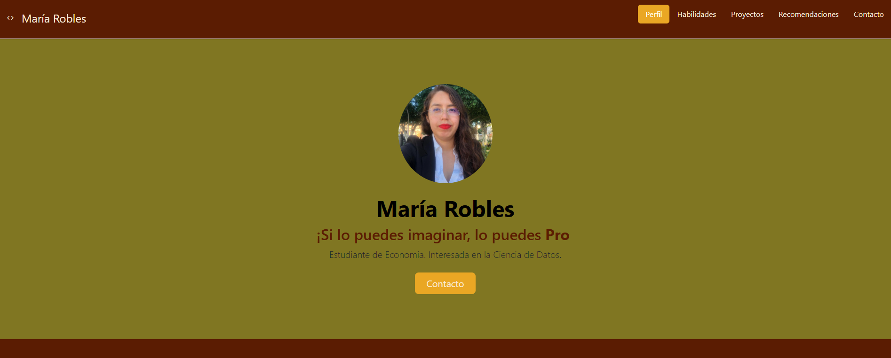

## Portafolio de proyectos

¡Hola! Soy **María Robles**, estudiante de Economía. Estoy interesada en la Ciencia de Datos. Aquí encontrarás información sobre mi trayectoria. 
___
### El proyecto cuenta con las secciones de: 

- 💻Habilidades
- 📄Proyectos 
- 👨‍💻Recomendaciones 
- ✉Contacto

### Creado con:
- HTML 
- CSS
- JavaScript

    
    

### Vista Previa

### *Espero que colaboremos pronto.*

____________________
### Creado en el bootcamp de TecnolochicasPro
[Tecnolochicas](https://tecnolochicas.mx/)
